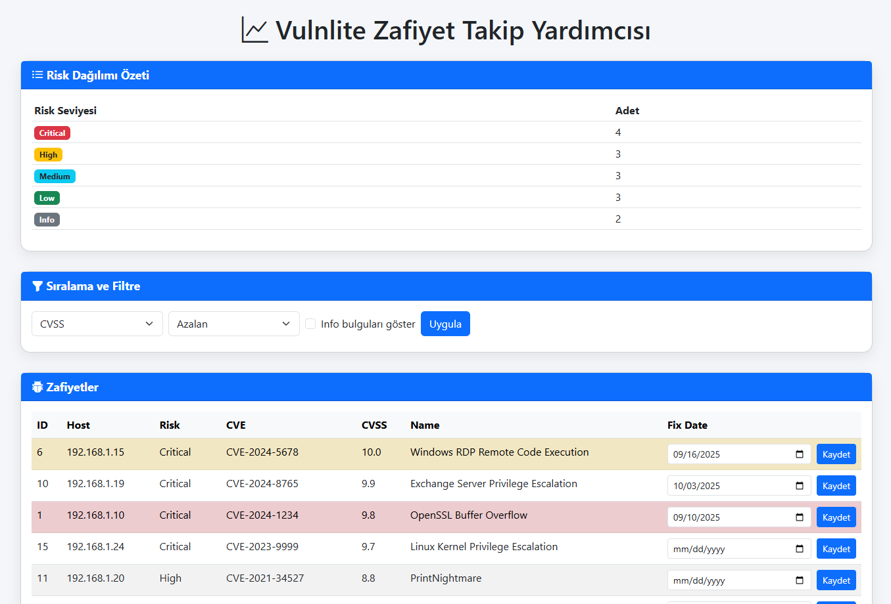

# VulnLite

VulnLite, Nessus çıktılarından (CSV) zafiyetleri sınıflandıran, takip eden ve görselleştiren
hafif ve açık kaynaklı bir araçtır.  
Basit bir Flask web arayüzü üzerinden çalışır.

## 🚀 Özellikler
- Nessus CSV dosyası yükleme
- Host, Risk Factor, CVE, CVSS skorlarının listelenmesi
- Risk dağılımını pie chart ile görselleştirme
- Fix Date (hedeflenen düzeltme tarihi) seçme ve takip
- Deadline uyarıları (3 gün kala sarı, deadline geçmişse kırmızı)

## 📦 Kurulum
```bash
git clone https://github.com/ygtyrdbk/vulnlite.git
cd vulnlite
pip install -r requirements.txt
```

## ▶️ Çalıştırma
python app.py ya da flask run 

Ardından tarayıcıdan `http://127.0.0.1:5000` adresini açın.

## 📝 Örnek
CSV dosyası yükleyin, ardından tablo, risk dağılım grafiği ve fix date takibini görün.



## 📜 Lisans
MIT
